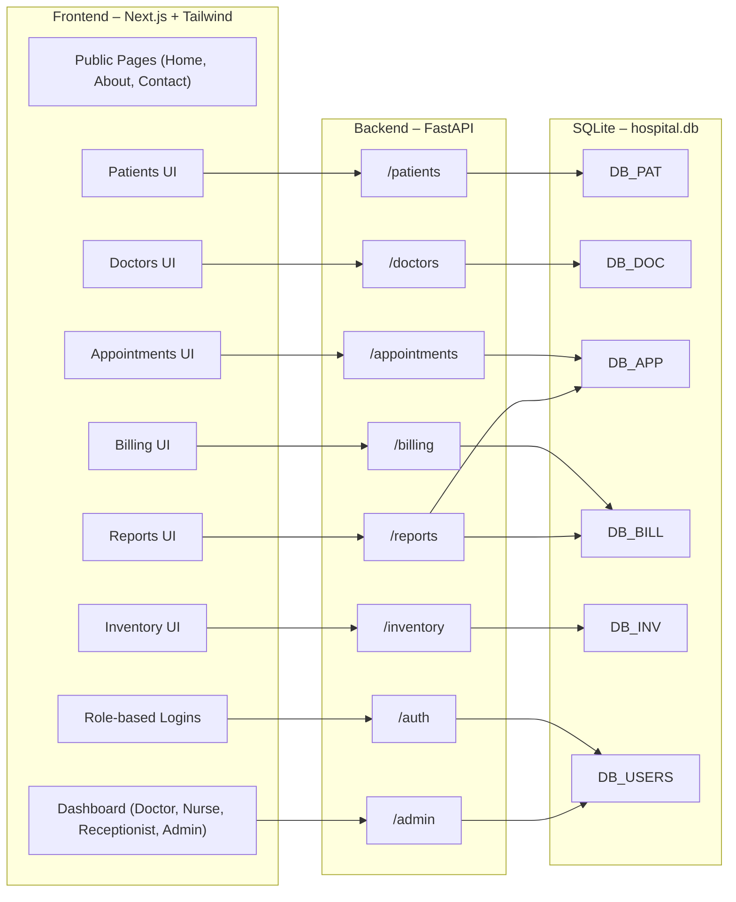

# 🏥 VITALIt-OS — System Architecture (2025 MVP)

This document outlines the final modular full-stack architecture for **VITALIt-OS**, a clinic-focused Hospital Management System. Designed for scale, modularity, and clarity.

---

## 📐 Architecture Overview



---

## 📂 Modules Breakdown

Each module contains:
- **FastAPI router** in `backend/routers/`
- **Pydantic schema** in `backend/schemas.py`
- **Typed frontend form + list** in `frontend/src/components/`

| Module         | Frontend Components                     | Backend Routes                          | DB Table(s)     |
|----------------|------------------------------------------|------------------------------------------|-----------------|
| **Patients**   | `PatientsForm.tsx`, `PatientsList.tsx`   | `routers/patients.py` → `/patients`     | `patients`      |
| **Doctors**    | `DoctorsForm.tsx`, `DoctorsList.tsx`     | `routers/doctors.py` → `/doctors`       | `doctors`       |
| **Appointments** | `AppointmentsForm.tsx`, `AppointmentsCalendar.tsx` | `routers/appointments.py` → `/appointments` | `appointments` |
| **Billing**    | `BillingForm.tsx`, `Invoice.tsx`         | `routers/billing.py` → `/billing`       | `bills`         |
| **Inventory**  | `InventoryForm.tsx`, `InventoryList.tsx` | `routers/inventory.py` → `/inventory`   | `inventory`     |
| **Auth**       | `LoginForm.tsx` per role                 | `routers/auth.py` → `/auth`             | `users`         |
| **Admin**      | `AdminDashboard.tsx`                     | `routers/admin.py` → `/admin`           | `users`         |
| **Reports**    | `ReportsList.tsx`                        | `routers/reports.py` → `/reports`       | aggregate views |

---

## 🧑‍⚕️ User Roles & Permissions

| Role         | Permissions |
|--------------|-------------|
| Admin        | All access: user management, reports, billing, settings |
| Doctor       | View appointments, write prescriptions, records |
| Nurse        | Update vitals, assist doctor, task checklist |
| Receptionist | Register patients, schedule, billing |
| Patient (Optional) | View personal records and bills (MVP skips portal) |

---

## 🔑 Auth Flow

- Separate login routes for each role
- Sessions handled via cookies or token (to be finalized)
- Role-based layout rendering

---

## 🧾 Reports Included

- Appointments per day/week/month
- Revenue reports
- Most common illnesses
- Doctor-wise visits

---

## 🚀 MVP Scope (Tonight)

✅ Patients  
✅ Appointments  
✅ Billing  
✅ Auth  
✅ Dashboards (Role-based)  
✅ Public Pages (Home, About, Contact, Login)  

---

## 📁 Folder Structure

```
vitalit-os/
├── backend/
│   ├── main.py
│   ├── routers/
│   │   ├── patients.py
│   │   ├── doctors.py
│   │   ├── appointments.py
│   │   ├── billing.py
│   │   ├── inventory.py
│   │   ├── auth.py
│   │   └── reports.py
│   ├── schemas.py
│   └── database.py
├── frontend/
│   ├── pages/
│   │   ├── index.tsx
│   │   ├── login.tsx
│   │   ├── dashboard/
│   ├── components/
│   │   ├── PatientsForm.tsx
│   │   ├── PatientsList.tsx
│   │   ├── DoctorsForm.tsx
│   │   ├── AppointmentsForm.tsx
│   │   ├── BillingForm.tsx
│   │   └── Invoice.tsx
│   └── utils/
├── hospital.db
└── README.md
```

---

## 💬 Final Notes

- Fully modular and swappable backend
- MVP will be SQLite, can migrate to Postgres later
- API-first — ready for mobile clients if needed
- Role-based isolation for security

**Built with clarity. Built for real clinics.**