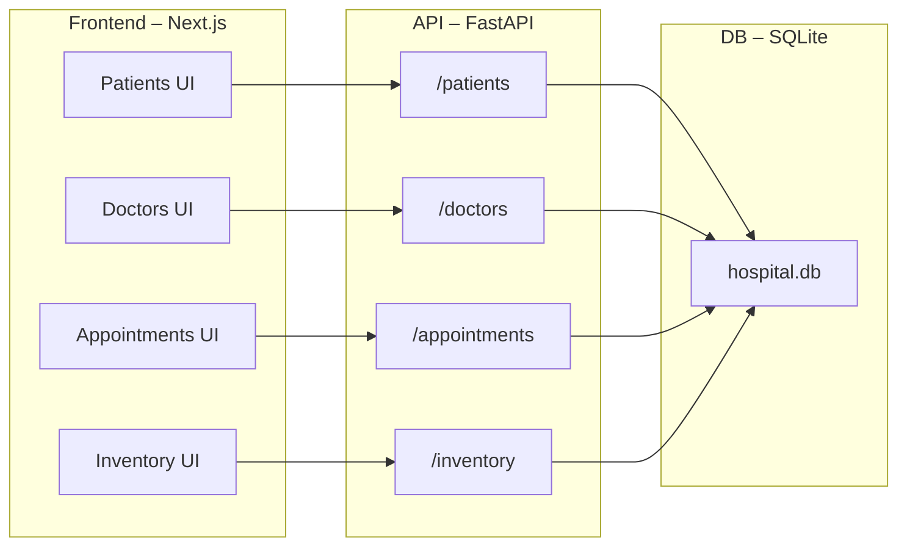

# VITALIt-OS Architecture

```mermaid
flowchart LR

  %% ---------- Frontend ----------
  subgraph FE [Frontend – Next.js]
    FE_PAT["Patients UI"]
    FE_DOC["Doctors UI"]
    FE_APP["Appointments UI"]
    FE_INV["Inventory UI"]
  end

  %% ---------- Backend API ----------
  subgraph API [API – FastAPI]
    API_PAT["/patients"]
    API_DOC["/doctors"]
    API_APP["/appointments"]
    API_INV["/inventory"]
  end

  %% ---------- Database ----------
  subgraph DB [DB – SQLite]
    DB_SQLITE["hospital.db"]
  end

  %% ---------- Connections ----------
  FE_PAT --> API_PAT --> DB_SQLITE
  FE_DOC --> API_DOC --> DB_SQLITE
  FE_APP --> API_APP --> DB_SQLITE
  FE_INV --> API_INV --> DB_SQLITE

```

Each module includes:
- Backend route in `backend/routers/`
- Typed schema in `backend/schemas.py`
- Frontend form and list component in `frontend/src/components/`
