# 🏥 VITALIt — System Architecture (2025+)

VITALIt is a modern, modular Hospital Management System (HMS) designed to streamline clinical operations across roles including doctors, nurses, receptionists, and admins. Built with a scalable frontend-backend split, this architecture ensures long-term maintainability and extension-readiness.

---

## 📦 Core Tech Stack

- **Frontend:** Next.js 14 + Tailwind CSS v4
- **Backend:** FastAPI (Python 3.11+)
- **Database:** SQLite (dev) → PostgreSQL (prod)
- **APIs:** REST-first, OpenAPI auto-generated docs
- **State Management:** React Server Components + Local State
- **Authentication:** Role-based via JWT (extendable to OAuth/SAML)
- **Deployment:** Docker (CI-ready)

---

## 🧭 Architecture Overview

```mermaid
flowchart LR

  subgraph FE [Frontend – Next.js + Tailwind]
    FE_Public["Public Pages"]
    FE_Login["Auth Screens"]
    FE_Dash["Role-based Dashboards"]
    FE_PAT["Patients Module"]
    FE_DOC["Doctors Module"]
    FE_APP["Appointments"]
    FE_BILL["Billing"]
    FE_INV["Inventory"]
    FE_REP["Reports"]
  end

  subgraph API [Backend – FastAPI]
    API_AUTH["/auth"]
    API_PAT["/patients"]
    API_DOC["/doctors"]
    API_APP["/appointments"]
    API_BILL["/billing"]
    API_INV["/inventory"]
    API_REP["/reports"]
    API_ADMIN["/admin"]
  end

  subgraph DB [Database – SQLite/PostgreSQL]
    DB_Users
    DB_Patients
    DB_Doctors
    DB_Appointments
    DB_Bills
    DB_Inventory
    DB_AuditLogs
  end

  %% Connections
  FE_PAT --> API_PAT --> DB_Patients
  FE_DOC --> API_DOC --> DB_Doctors
  FE_APP --> API_APP --> DB_Appointments
  FE_BILL --> API_BILL --> DB_Bills
  FE_INV --> API_INV --> DB_Inventory
  FE_REP --> API_REP --> DB_Appointments & DB_Bills
  FE_Login --> API_AUTH --> DB_Users
  FE_Dash --> API_ADMIN --> DB_Users
```

---

## 🧩 Modules Overview

Each module includes:
- FastAPI router in `backend/routers/`
- Typed schema in `backend/schemas.py`
- Reusable form + table components in `frontend/src/components/`

| Module         | Frontend UI Components             | Backend Routes     | Database Tables       |
|----------------|------------------------------------|---------------------|------------------------|
| Patients       | `PatientsForm.tsx`, `PatientsList` | `/patients`         | `patients`            |
| Doctors        | `DoctorsForm.tsx`, `DoctorsList`   | `/doctors`          | `doctors`             |
| Appointments   | `AppointmentsForm`, `CalendarView` | `/appointments`     | `appointments`        |
| Billing        | `BillingForm`, `InvoiceView`       | `/billing`          | `bills`               |
| Inventory      | `InventoryTable`, `StockForm`      | `/inventory`        | `inventory`           |
| Reports        | `ReportsPage`                      | `/reports`          | aggregate + computed  |
| Auth           | `LoginForm`, `RoleRedirect`        | `/auth`             | `users`               |
| Admin Settings | `AdminDashboard`, `UserManager`    | `/admin`            | `users`, `audit_logs` |

---

## 🔐 Roles & Access Matrix

| Role         | Permissions Summary |
|--------------|---------------------|
| Admin        | All access, settings, users, audit |
| Doctor       | Appointments, records, prescriptions |
| Nurse        | Vitals, assist doctors, limited patient info |
| Receptionist | Scheduling, billing, patient intake |
| Patient*     | View prescriptions, appointments (optional) |

---

## ⚙️ Backend Conventions

- All endpoints use `/api/v1/{module}` pattern
- Pydantic schemas for type-safe request/response
- Centralized database session with context-managed commits
- Error handling via custom `HTTPException` mappers
- Logs structured (ready for ELK/Datadog)

---

## 🖥️ Frontend Conventions

- Modular components grouped by feature
- Uses App Router with RSC optimizations
- API calls wrapped via `/utils/api.ts`
- Forms use `zod` + `react-hook-form` validation
- Dynamic route guards based on role

---

## 🧪 Testing & CI/CD

- Backend: `pytest` with async test DB
- Frontend: `playwright` (planned)
- GitHub Actions: lint → test → build
- Deploy: Docker + Render/Vercel (optional Helm)

---

## 🧠 Future Enhancements

- [ ] Role-permission matrix in DB
- [ ] Lab reports + uploads
- [ ] Multi-language + dark mode
- [ ] Patient portal
- [ ] Staff scheduling
- [ ] Mobile PWA

---

Built for clarity. Modular by design. Scalable by default.